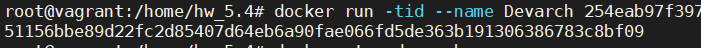

# №1
## 1.1
Написанный мной Dockerfile
```
root@vagrant:/home/hw_5.4# cat Dockerfile
FROM archlinux:latest

RUN pacman -Syy
RUN yes | pacman -Syy ponysay

ENTRYPOINT ["/usr/bin/ponysay"]
CMD ["Hey, netology”]
```
## 1.2
Скриншот вывода командной строки после запуска контейнера из вашего базового образа

## 1.3
Ссылку на образ в docker-hub
[docker hub](https://hub.docker.com/repository/docker/dozak/hw-5.4-arch)

# №2