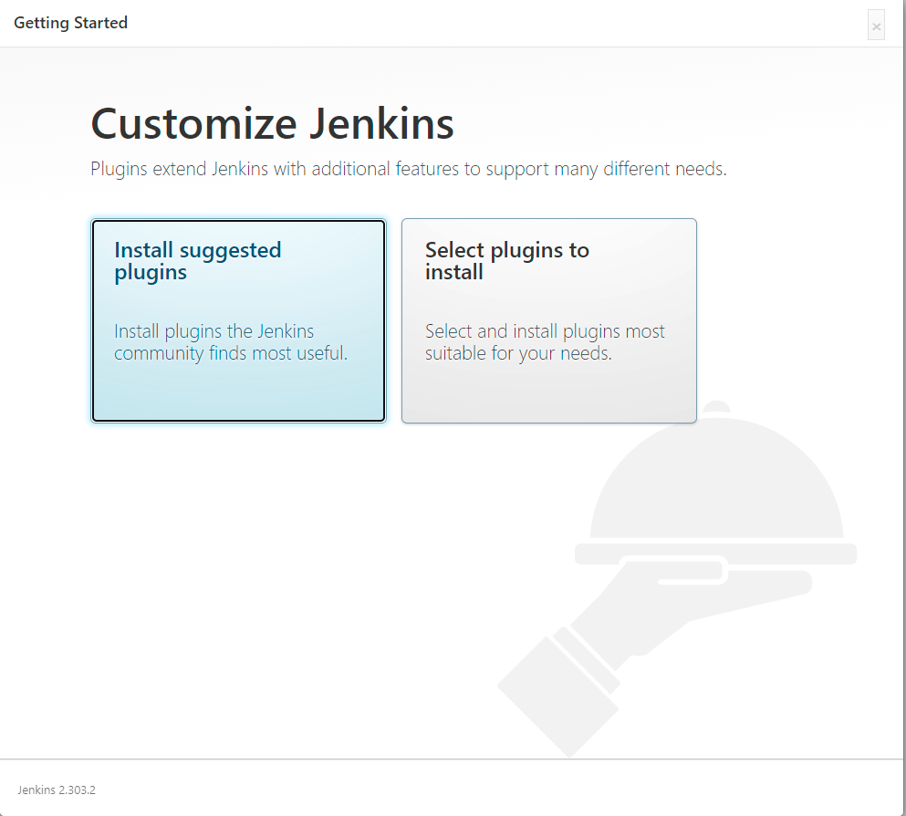

# №1
## 1.1
Написанный мной Dockerfile
```
root@vagrant:/home/hw_5.4# cat Dockerfile
FROM archlinux:latest

RUN pacman -Syy
RUN yes | pacman -Syy ponysay

ENTRYPOINT ["/usr/bin/ponysay"]
CMD ["Hey, netology”]
```
## 1.2
Скриншот вывода командной строки после запуска контейнера из вашего базового образа

## 1.3
Ссылку на образ в docker-hub
[docker hub](https://hub.docker.com/repository/docker/dozak/hw-5.4-arch)

# №2
- Наполнения 2х Dockerfile из задания
> Dockerfile amazoncorreto
> ```
> #Jenkins 5.4.2.1
> FROM amazoncorretto:latest
> ADD https://get.jenkins.io/war-stable/latest/jenkins.war /root/
> WORKDIR /root
> EXPOSE 8081
> ENTRYPOINT ["java"]
> CMD ["-jar","jenkins.war"]
> ```

> Dockerfile ubuntu:latest
> ```
> #Jenkins 5.4.2.2.
> FROM ubuntu:latest
> RUN apt-get update && \
>    apt-get install -y openjdk-11-jdk
> ADD https://get.jenkins.io/war-stable/latest/jenkins.war /root/
> WORKDIR /root
> EXPOSE 8082
> ENTRYPOINT ["java"]
> CMD ["-jar","jenkins.war"]
> ```
- Скриншоты логов запущенных вами контейнеров (из командной строки)
> Вывод из консоли логов Docker контейнера - amazoncorretto
```
Running from: /root/jenkins.war
webroot: $user.home/.jenkins
2021-10-31 14:19:07.585+0000 [id=1]     INFO    org.eclipse.jetty.util.log.Log#initialized: Logging initialized @5178ms to org.eclipse.jetty.util.log.JavaUtilLog
2021-10-31 14:19:07.762+0000 [id=1]     INFO    winstone.Logger#logInternal: Beginning extraction from war file
2021-10-31 14:19:11.689+0000 [id=1]     WARNING o.e.j.s.handler.ContextHandler#setContextPath: Empty contextPath
2021-10-31 14:19:11.850+0000 [id=1]     INFO    org.eclipse.jetty.server.Server#doStart: jetty-9.4.43.v20210629; built: 2021-06-30T11:07:22.254Z; git: 526006ecfa3af7f1a27ef3a288e2bef7ea9dd7e8; jvm 1.8.0_312-b07
2021-10-31 14:19:13.967+0000 [id=1]     INFO    o.e.j.w.StandardDescriptorProcessor#visitServlet: NO JSP Support for /, did not find org.eclipse.jetty.jsp.JettyJspServlet
2021-10-31 14:19:14.717+0000 [id=1]     INFO    o.e.j.s.s.DefaultSessionIdManager#doStart: DefaultSessionIdManager workerName=node0
2021-10-31 14:19:14.717+0000 [id=1]     INFO    o.e.j.s.s.DefaultSessionIdManager#doStart: No SessionScavenger set, using defaults
2021-10-31 14:19:14.719+0000 [id=1]     INFO    o.e.j.server.session.HouseKeeper#startScavenging: node0 Scavenging every 660000ms
2021-10-31 14:19:16.487+0000 [id=1]     INFO    hudson.WebAppMain#contextInitialized: Jenkins home directory: /root/.jenkins found at: $user.home/.jenkins
2021-10-31 14:19:20.442+0000 [id=1]     INFO    o.e.j.s.handler.ContextHandler#doStart: Started w.@2ca65ce4{Jenkins v2.303.2,/,file:///root/.jenkins/war/,AVAILABLE}{/root/.jenkins/war}
2021-10-31 14:19:20.614+0000 [id=1]     INFO    o.e.j.server.AbstractConnector#doStart: Started ServerConnector@3932c79a{HTTP/1.1, (http/1.1)}{0.0.0.0:8080}
2021-10-31 14:19:20.614+0000 [id=1]     INFO    org.eclipse.jetty.server.Server#doStart: Started @18207ms
2021-10-31 14:19:20.615+0000 [id=21]    INFO    winstone.Logger#logInternal: Winstone Servlet Engine running: controlPort=disabled
2021-10-31 14:19:23.913+0000 [id=28]    INFO    jenkins.InitReactorRunner$1#onAttained: Started initialization
2021-10-31 14:19:23.939+0000 [id=28]    INFO    jenkins.InitReactorRunner$1#onAttained: Listed all plugins
2021-10-31 14:19:25.475+0000 [id=28]    INFO    jenkins.InitReactorRunner$1#onAttained: Prepared all plugins
2021-10-31 14:19:25.485+0000 [id=26]    INFO    jenkins.InitReactorRunner$1#onAttained: Started all plugins
2021-10-31 14:19:25.492+0000 [id=29]    INFO    jenkins.InitReactorRunner$1#onAttained: Augmented all extensions
2021-10-31 14:19:26.135+0000 [id=26]    INFO    jenkins.InitReactorRunner$1#onAttained: System config loaded
2021-10-31 14:19:26.135+0000 [id=28]    INFO    jenkins.InitReactorRunner$1#onAttained: System config adapted
2021-10-31 14:19:26.136+0000 [id=26]    INFO    jenkins.InitReactorRunner$1#onAttained: Loaded all jobs
2021-10-31 14:19:26.136+0000 [id=26]    INFO    jenkins.InitReactorRunner$1#onAttained: Configuration for all jobs updated
2021-10-31 14:19:26.195+0000 [id=42]    INFO    hudson.model.AsyncPeriodicWork#lambda$doRun$0: Started Download metadata
2021-10-31 14:19:26.207+0000 [id=42]    INFO    hudson.util.Retrier#start: Attempt #1 to do the action check updates server
2021-10-31 14:19:26.623+0000 [id=26]    INFO    jenkins.install.SetupWizard#init:

*************************************************************
*************************************************************
*************************************************************

Jenkins initial setup is required. An admin user has been created and a password generated.
Please use the following password to proceed to installation:

5fe69e3f8a5e47db9fcca1bf6ab99c5c

This may also be found at: /root/.jenkins/secrets/initialAdminPassword

*************************************************************
*************************************************************
*************************************************************
```
> Вывод из консоли логов Docker контейнера - ubuntu:latest
```
Running from: /root/jenkins.war
webroot: $user.home/.jenkins
2021-10-31 14:25:45.631+0000 [id=1]     INFO    org.eclipse.jetty.util.log.Log#initialized: Logging initialized @882ms to org.eclipse.jetty.util.log.JavaUtilLog
2021-10-31 14:25:45.719+0000 [id=1]     INFO    winstone.Logger#logInternal: Beginning extraction from war file
2021-10-31 14:25:47.785+0000 [id=1]     WARNING o.e.j.s.handler.ContextHandler#setContextPath: Empty contextPath
2021-10-31 14:25:48.149+0000 [id=1]     INFO    org.eclipse.jetty.server.Server#doStart: jetty-9.4.43.v20210629; built: 2021-06-30T11:07:22.254Z; git: 526006ecfa3af7f1a27ef3a288e2bef7ea9dd7e8; jvm 11.0.11+9-Ubuntu-0ubuntu2.20.04
2021-10-31 14:25:48.602+0000 [id=1]     INFO    o.e.j.w.StandardDescriptorProcessor#visitServlet: NO JSP Support for /, did not find org.eclipse.jetty.jsp.JettyJspServlet
2021-10-31 14:25:48.656+0000 [id=1]     INFO    o.e.j.s.s.DefaultSessionIdManager#doStart: DefaultSessionIdManager workerName=node0
2021-10-31 14:25:48.656+0000 [id=1]     INFO    o.e.j.s.s.DefaultSessionIdManager#doStart: No SessionScavenger set, using defaults
2021-10-31 14:25:48.658+0000 [id=1]     INFO    o.e.j.server.session.HouseKeeper#startScavenging: node0 Scavenging every 600000ms
2021-10-31 14:25:49.156+0000 [id=1]     INFO    hudson.WebAppMain#contextInitialized: Jenkins home directory: /root/.jenkins found at: $user.home/.jenkins
2021-10-31 14:25:49.553+0000 [id=1]     INFO    o.e.j.s.handler.ContextHandler#doStart: Started w.@56d93692{Jenkins v2.303.2,/,file:///root/.jenkins/war/,AVAILABLE}{/root/.jenkins/war}
2021-10-31 14:25:49.622+0000 [id=1]     INFO    o.e.j.server.AbstractConnector#doStart: Started ServerConnector@5bf0fe62{HTTP/1.1, (http/1.1)}{0.0.0.0:8080}
2021-10-31 14:25:49.622+0000 [id=1]     INFO    org.eclipse.jetty.server.Server#doStart: Started @4876ms
2021-10-31 14:25:49.632+0000 [id=23]    INFO    winstone.Logger#logInternal: Winstone Servlet Engine running: controlPort=disabled
2021-10-31 14:25:50.165+0000 [id=30]    INFO    jenkins.InitReactorRunner$1#onAttained: Started initialization
2021-10-31 14:25:50.206+0000 [id=31]    INFO    jenkins.InitReactorRunner$1#onAttained: Listed all plugins
WARNING: An illegal reflective access operation has occurred
WARNING: Illegal reflective access by com.google.inject.internal.cglib.core.$ReflectUtils$2 (file:/root/.jenkins/war/WEB-INF/lib/guice-4.0.jar) to method java.lang.ClassLoader.defineClass(java.lang.String,byte[],int,int,java.security.ProtectionDomain)
WARNING: Please consider reporting this to the maintainers of com.google.inject.internal.cglib.core.$ReflectUtils$2
WARNING: Use --illegal-access=warn to enable warnings of further illegal reflective access operations
WARNING: All illegal access operations will be denied in a future release
2021-10-31 14:25:51.441+0000 [id=31]    INFO    jenkins.InitReactorRunner$1#onAttained: Prepared all plugins
2021-10-31 14:25:51.445+0000 [id=31]    INFO    jenkins.InitReactorRunner$1#onAttained: Started all plugins
2021-10-31 14:25:51.461+0000 [id=29]    INFO    jenkins.InitReactorRunner$1#onAttained: Augmented all extensions
2021-10-31 14:25:52.215+0000 [id=31]    INFO    jenkins.InitReactorRunner$1#onAttained: System config loaded
2021-10-31 14:25:52.216+0000 [id=31]    INFO    jenkins.InitReactorRunner$1#onAttained: System config adapted
2021-10-31 14:25:52.216+0000 [id=31]    INFO    jenkins.InitReactorRunner$1#onAttained: Loaded all jobs
2021-10-31 14:25:52.216+0000 [id=31]    INFO    jenkins.InitReactorRunner$1#onAttained: Configuration for all jobs updated
2021-10-31 14:25:52.265+0000 [id=44]    INFO    hudson.model.AsyncPeriodicWork#lambda$doRun$0: Started Download metadata
2021-10-31 14:25:52.348+0000 [id=44]    INFO    hudson.util.Retrier#start: Attempt #1 to do the action check updates server
2021-10-31 14:25:54.343+0000 [id=31]    INFO    jenkins.install.SetupWizard#init:

*************************************************************
*************************************************************
*************************************************************

Jenkins initial setup is required. An admin user has been created and a password generated.
Please use the following password to proceed to installation:

9c583b9dbe6b418ebf38645dd4160e95

This may also be found at: /root/.jenkins/secrets/initialAdminPassword

*************************************************************
*************************************************************
*************************************************************

2021-10-31 14:26:20.876+0000 [id=29]    INFO    jenkins.InitReactorRunner$1#onAttained: Completed initialization
2021-10-31 14:26:20.902+0000 [id=22]    INFO    hudson.WebAppMain$3#run: Jenkins is fully up and running
2021-10-31 14:26:21.347+0000 [id=44]    INFO    h.m.DownloadService$Downloadable#load: Obtained the updated data file for hudson.tasks.Maven.MavenInstaller
2021-10-31 14:26:21.352+0000 [id=44]    INFO    hudson.util.Retrier#start: Performed the action check updates server successfully at the attempt #1
2021-10-31 14:26:21.357+0000 [id=44]    INFO    hudson.model.AsyncPeriodicWork#lambda$doRun$0: Finished Download metadata. 29,080 m
```
- Скриншоты веб-интерфейса Jenkins запущенных вами контейнеров
> Web-интерфейс jenkins


> Web-интерфейс jenkins после ввода пароля



> Web-интерфейс jenkins после установки плагинов


- Ссылки на образы в вашем хранилище docker-hub
> [Jenkins-amazoncorreto](https://hub.docker.com/repository/docker/dozak/jenkins_1)
  
> [Jenkins-Ubuntu](https://hub.docker.com/repository/docker/dozak/jenkins_2)


# №3
