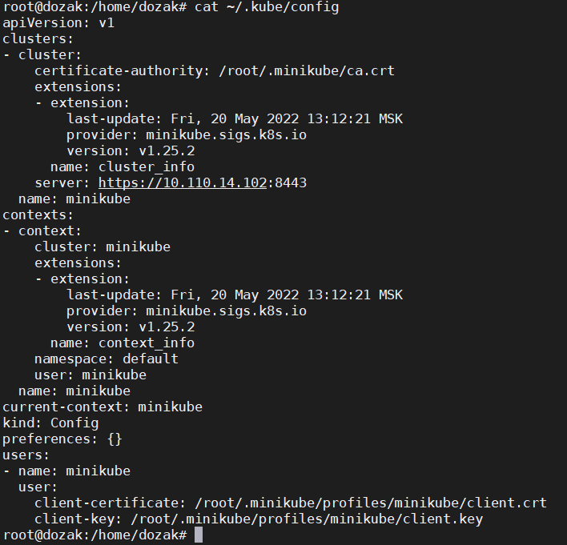

# Домашнее задание к занятию "12.2 Команды для работы с Kubernetes"
## Задание 1: Запуск пода из образа в деплойменте
>Для начала следует разобраться с прямым запуском приложений из консоли. Такой подход поможет быстро развернуть инструменты отладки в кластере. Требуется запустить деплоймент на основе образа из hello world уже через deployment. Сразу стоит запустить 2 копии приложения (replicas=2).
>
>Требования:
> * пример из hello world запущен в качестве deployment
> * количество реплик в deployment установлено в 2
> * наличие deployment можно проверить командой kubectl get deployment
> * наличие подов можно проверить командой kubectl get pods

[Deployment](files/12.4/deployment.yaml)
```
root@dozak:/home/dozak# kubectl create namespace app-namespace
namespace/app-namespace created
root@dozak:/home/dozak# kubectl apply -f deployment.yaml
deployment.apps/hello-world created
root@dozak:/home/dozak# kubectl get deploy -n app-namespace
NAME          READY   UP-TO-DATE   AVAILABLE   AGE
hello-world   2/2     2            2           28s
root@dozak:/home/dozak# kubectl get po -n app-namespace
NAME                           READY   STATUS    RESTARTS   AGE
hello-world-5c6748dcbc-r6d2n   1/1     Running   0          34s
hello-world-5c6748dcbc-tklf8   1/1     Running   0          34s
```
## Задание 2: Просмотр логов для разработки
>Разработчикам крайне важно получать обратную связь от штатно работающего приложения и, еще важнее, об ошибках в его работе. Требуется создать пользователя и выдать ему доступ на чтение конфигурации и логов подов в app-namespace.
>
>Требования:
> * создан новый токен доступа для пользователя
> * пользователь прописан в локальный конфиг (~/.kube/config, блок users)
> * пользователь может просматривать логи подов и их конфигурацию (kubectl logs pod <pod_id>, kubectl describe pod <pod_id>)

[Service_accaunt](files/12.4/Service_accaunt.yaml)
[Role](files/12.4/role.yaml)
[Role_Binding](files/12.4/Role_Binding.yaml)

```
root@dozak:/home/dozak# kubectl apply -f Service_accaunt.yaml -n app-namespace
serviceaccount/doz created
root@dozak:/home/dozak# kubectl apply -f role.yaml -n app-namespace
role.rbac.authorization.k8s.io/view created
root@dozak:/home/dozak# kubectl apply -f Role_Binding.yaml -n app-namespace
rolebinding.rbac.authorization.k8s.io/pod-view created
root@dozak:/home/dozak# kubectl get secret
NAME                  TYPE                                  DATA   AGE
default-token-s9jr8   kubernetes.io/service-account-token   3      2d23h
root@dozak:/home/dozak# cat ~/.kube/config
```

```
root@dozak:/home/dozak# kubectl get po -n app-namespace --as=system:serviceaccou
NAME                           READY   STATUS    RESTARTS   AGE
hello-world-5c6748dcbc-r6d2n   1/1     Running   0          54m
hello-world-5c6748dcbc-tklf8   1/1     Running   0          54m
root@dozak:/home/dozak# kubectl logs hello-world-5c6748dcbc-r6d2n -n app-namespace --as=system:serviceaccount:app-namespace:doz

root@dozak:/home/dozak# kubectl describe po hello-world-5c6748dcbc-r6d2n -n app-namespace --as=system:serviceaccount:app-namespace:doz                Name:         hello-world-5c6748dcbc-r6d2n
Namespace:    app-namespace
Priority:     0
Node:         dozak/10.110.14.102
Start Time:   Mon, 23 May 2022 12:12:27 +0300
Labels:       app=hello-world
              pod-template-hash=5c6748dcbc
Annotations:  <none>
Status:       Running
IP:           172.17.0.7
IPs:
  IP:           172.17.0.7
Controlled By:  ReplicaSet/hello-world-5c6748dcbc
Containers:
  hello-world:
    Container ID:   docker://6ddd7f93b70158221cca2fe24a9bf6b1c9221f503b922e5a43a78e245155c463
    Image:          k8s.gcr.io/echoserver:1.4
    Image ID:       docker-pullable://k8s.gcr.io/echoserver@sha256:5d99aa1120524c801bc8c1a7077e8f5ec122ba16b6dda1a5d3826057f67b9bcb
    Port:           8080/TCP
    Host Port:      0/TCP
    State:          Running
      Started:      Mon, 23 May 2022 12:12:38 +0300
    Ready:          True
    Restart Count:  0
    Environment:    <none>
    Mounts:
      /var/run/secrets/kubernetes.io/serviceaccount from kube-api-access-68v4t (ro)
Conditions:
  Type              Status
  Initialized       True
  Ready             True
  ContainersReady   True
  PodScheduled      True
Volumes:
  kube-api-access-68v4t:
    Type:                    Projected (a volume that contains injected data from multiple sources)
    TokenExpirationSeconds:  3607
    ConfigMapName:           kube-root-ca.crt
    ConfigMapOptional:       <nil>
    DownwardAPI:             true
QoS Class:                   BestEffort
Node-Selectors:              <none>
Tolerations:                 node.kubernetes.io/not-ready:NoExecute op=Exists for 300s
                             node.kubernetes.io/unreachable:NoExecute op=Exists for 300s
Events:                      <none>

root@dozak:/home/dozak# kubectl delete po hello-world-5c6748dcbc-r6d2n -n app-namespace --as=system:serviceaccount:app-namespace:doz
Error from server (Forbidden): pods "hello-world-5c6748dcbc-r6d2n" is forbidden: User "system:serviceaccount:app-namespace:doz" cannot delete resource "pods" in API group "" in the namespace "app-namespace"
root@dozak:/home/dozak# kubectl delete po hello-world-5c6748dcbc-tklf8 -n app-namespace --as=system:serviceaccount:app-namespace:doz
Error from server (Forbidden): pods "hello-world-5c6748dcbc-tklf8" is forbidden: User "system:serviceaccount:app-namespace:doz" cannot delete resource "pods" in API group "" in the namespace "app-namespace"
root@dozak:/home/dozak# kubectl get deploy -n app-namespace --as=system:serviceaccount:app-namespace:doz
Error from server (Forbidden): deployments.apps is forbidden: User "system:serviceaccount:app-namespace:doz" cannot list resource "deployments" in API group "apps" in the namespace "app-namespace"
root@dozak:/home/dozak# kubectl get po --as=system:serviceaccount:app-namespace:doz
Error from server (Forbidden): pods is forbidden: User "system:serviceaccount:app-namespace:doz" cannot list resource "pods" in API group "" in the namespace "default"
```
## Задание 3: Изменение количества реплик
> Поработав с приложением, вы получили запрос на увеличение количества реплик приложения для нагрузки. Необходимо изменить запущенный deployment, увеличив количество реплик до 5. Посмотрите статус запущенных подов после увеличения реплик.
> 
> Требования:
> * в deployment из задания 1 изменено количество реплик на 5
> * проверить что все поды перешли в статус running (kubectl get pods)


